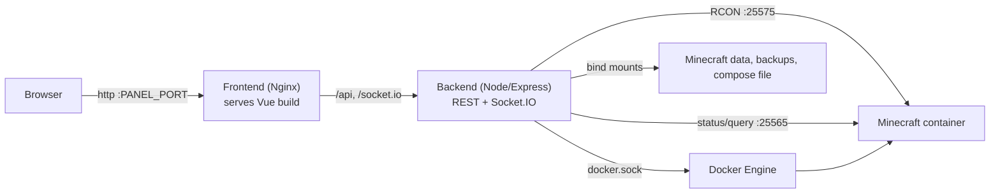

# MC Control Panel

A self-hosted web control panel for managing a Minecraft server that runs in Docker.

Monitor live status, stream the console, manage players, edit `server.properties`, design the server icon, and create world backups — all from a single dashboard.


## Features

- **Live status control** — one ONLINE/OFFLINE toggle that starts and stops the Minecraft container with graceful shutdown (`save-all` via RCON)
- **Server data** — CPU and RAM usage, Minecraft version, world name, and uptime
- **Live console** — streaming Docker logs over Socket.IO with an All/Chat view toggle (Chat mode sends `/say` directly), text filtering, loadable history, command history, and auto-reconnect after restarts
- **Player management** — kick, ban, temporary bans with automatic expiry, unban, op/deop, whitelist manager, and the ban list — via RCON
- **Session timers** — live per-player connection time, derived from the server logs
- **MOTD editor** — colorized `§`-code editor with live preview and cursor-aware code insertion
- **Server icon editor** — 64×64 pixel editor with palette, fill, procedural generators, and image upload; writes `server-icon.png`
- **Power scheduling** — automatic server start/stop events per time of day and day of week
- **Settings** — edit `server.properties` with validation and automatic Docker Compose synchronization
- **Backups** — safe world backups (save-off/save-on coordination), list, download, delete, restore with rollback, scheduled backups, and automatic retention
- **Security** — Bearer-token authentication for the API and WebSocket connections, constant-time token comparison, per-IP lockout after repeated failures, hardened containers
- **Docker-native** — two small images with an Nginx frontend that proxies `/api` and `/socket.io` to the backend

## Architecture



- **Frontend** — Vue 3 + Vite, served by Nginx with security headers and a strict Content-Security-Policy. Same-origin API calls: no backend URL is embedded in the production build.
- **Backend** — Express + Socket.IO. Uses Dockerode for container operations and `minecraft-server-util` for status/query and RCON. Runs as a non-root user with all Linux capabilities dropped.
- **Isolation** — the backend port is never published to the host. Only the Nginx frontend is exposed.

## Requirements

- Docker Engine with Compose v2
- A Minecraft server already running in its own Docker Compose stack, with:
  - a container you can name (default expected name: `minecraft-server`)
  - RCON enabled (`enable-rcon=true` and an `rcon.password` in `server.properties`)
  - a data directory containing `server.properties` (the panel reads and writes it)
  - an external Docker network shared with the panel stack

> 🧱 **Recommended server image** — this panel is designed for and tested against
> [itzg/docker-minecraft-server](https://github.com/itzg/docker-minecraft-server).
> That image supports all the features used here out of the box (RCON via
> `ENABLE_RCON`/`RCON_PASSWORD`, status/query ports, and a data directory layout
> with `server.properties`), and the property↔environment mapping in
> `backend/src/dockerService.js` follows its variable names.

## Installation

### Step 1 — Enable RCON on the Minecraft server

In the Minecraft server's `server.properties`:

```properties
enable-rcon=true
rcon.port=25575
rcon.password=choose-a-strong-password
```

With [itzg/docker-minecraft-server](https://github.com/itzg/docker-minecraft-server) you can do the same via environment variables in the Minecraft Compose file:

```yaml
environment:
  ENABLE_RCON: "true"
  RCON_PORT: 25575
  RCON_PASSWORD: "choose-a-strong-password"
```

Restart the Minecraft container afterwards.

### Step 2 — Create the shared Docker network

The panel attaches to your Minecraft stack's network so it can reach RCON and the status port by container name.

```bash
docker network create minecraft_net
```

Attach your Minecraft stack to that network by adding to its `docker-compose.yml`:

```yaml
networks:
  minecraft_net:
    external: true
```

and to the Minecraft service:

```yaml
    networks:
      - minecraft_net
```

> Already using a network for the Minecraft stack (e.g. the default project network)? Just reuse its name in `MINECRAFT_NETWORK` below instead.

### Step 3 — Clone the repository

```bash
git clone https://github.com/<your-username>/mc-panel.git
cd mc-panel
```

### Step 4 — Configure the environment

```bash
cp .env.example .env
```

Edit `.env` and set the values:

| Variable | Required | Description |
|---|---|---|
| `MINECRAFT_ROOT` | ✅ | Absolute host path of your Minecraft Compose stack. Must contain `minecraft_data/` (with `server.properties`), `backups/`, and the stack's `docker-compose.yml`. |
| `MINECRAFT_NETWORK` | ✅ | Name of the external network created in Step 2. |
| `RCON_PASSWORD` | ✅ | Must match `rcon.password` from the Minecraft server. |
| `API_TOKEN` | ✅ | Strong random token that protects the panel API. Generate with `openssl rand -hex 32`. |
| `PANEL_PORT` | — | Host port for the panel UI (default `8081`). |
| `TARGET_CONTAINER_NAME` | — | Your Minecraft container name (default `minecraft-server`). |
| `MC_HOST` / `RCON_HOST` | — | Hosts for status probes and RCON, as seen from the panel container (default `minecraft-server`). |
| `RCON_PORT` / `MC_STATUS_PORT` / `MC_QUERY_PORT` | — | Ports (defaults `25575` / `25565` / `25565`). |
| `DOCKER_SOCKET_GID` | — | Group ID of `/var/run/docker.sock` on the host: `stat -c '%g' /var/run/docker.sock`. |
| `CORS_ORIGIN` | — | Allowed CORS origin (default `http://localhost:8081`; update it if you serve the panel from another origin). |
| `ALLOW_UNSAFE_BACKUP` | — | `1` allows backups even if `save-off` fails (not recommended). |
| `ENABLE_BACKUP_DOWNLOAD` | — | `0` disables the backup download endpoint. |
| `BACKUP_SCHEDULE_ENABLED` / `BACKUP_INTERVAL_HOURS` / `BACKUP_RETENTION` | — | Initial scheduled-backup defaults (the panel UI can override them at runtime). |

The full list with comments lives in [`.env.example`](.env.example).

> `.env` contains secrets. It is git-ignored — never commit it.

### Step 5 — Build and start

```bash
docker compose up -d --build
```

Check that both services become healthy:

```bash
docker compose ps
```

### Step 6 — Verify

```bash
curl http://localhost:8081/api/health
# {"ok":true,"message":"Server healthy, Docker reachable"}
```

Then open `http://localhost:8081` (or your `PANEL_PORT`) in a browser. If the server status shows ONLINE and live logs stream in, the panel is connected.

### Updating

```bash
git pull
docker compose up -d --build
```

If you ever change `API_TOKEN`, rebuild the frontend image so the new token is embedded:

```bash
docker compose up -d --build
```

### Uninstalling

```bash
docker compose down
```

This stops only the panel — your Minecraft server keeps running.

## Security

**Built-in protections**

- Every endpoint except `/api/health` and the Socket.IO log stream require `Authorization: Bearer <API_TOKEN>` (same token for the WebSocket). Tokens are compared in constant time.
- Failed authentication attempts are rate-limited per IP (20 failures/minute → 5-minute lockout).
- The backend runs as a non-root user with all Linux capabilities dropped and `no-new-privileges`; it is **never** published to the host — only Nginx is reachable.
- The frontend ships security headers (CSP, `nosniff`, `DENY` frame policy, etc.) and has no XSS sinks; user-provided content (MOTD, chat) is HTML-escaped before rendering.
- Input validation everywhere: player names and reasons are whitelisted/regex-checked, backup names reject path traversal, icons are validated as real 64×64 PNGs, request bodies are size-limited.

**Things you must know**

- **The Docker socket is mounted into the backend.** This is what lets the panel start/stop the Minecraft container, but it also means the panel has control over the Docker host. Only expose the panel to people you trust, and never publish the backend port.
- **The `API_TOKEN` is embedded in the frontend bundle at build time** so the browser can call the API. Anyone with panel access can extract it — treat panel access as full server access. Rotate the token (`openssl rand -hex 32`, update `.env`, rebuild) if it ever leaks.
- **Do not expose the panel over plain HTTP on the internet.** Put it behind TLS. A reverse proxy with Let's Encrypt works with no panel changes:

  ```nginx
  server {
      listen 443 ssl;
      server_name panel.example.com;
      ssl_certificate     /etc/letsencrypt/live/panel.example.com/fullchain.pem;
      ssl_certificate_key /etc/letsencrypt/live/panel.example.com/privkey.pem;
      location / {
          proxy_pass http://127.0.0.1:8081;
          proxy_set_header Host $host;
      }
  }
  ```

  Or with Caddy:

  ```
  panel.example.com {
      reverse_proxy 127.0.0.1:8081
  }
  ```

- For an extra layer (e.g. before adding your own user system), restrict the panel with HTTP Basic Auth in your reverse proxy.
- Keep the host up to date and follow Docker's own socket-security guidance.

## Backups

Backups are created safely against a live world:

1. RCON `save-all` flushes pending writes
2. `save-off` pauses auto-saving
3. The world directory is archived with `tar`
4. `save-on` restores automatic saving

Backups are serialized (one at a time) and abort if `save-off` fails, unless `ALLOW_UNSAFE_BACKUP=1`. They are stored in `$MINECRAFT_ROOT/backups` and never copied into images.

**Scheduled backups & retention** — run automatically every N hours (off by default) and prune old archives, keeping the most recent N. The schedule persists as a JSON file inside the backups directory.

**Restore** — runs as a background job: the server is stopped gracefully, a safety snapshot of the current world is created, the backup is extracted in place, and the server is started again. On extraction failure the previous world is rolled back.

## Local development

Prerequisites: Node.js ≥ 18 and access to a Docker socket.

```bash
npm install
npm --prefix backend install
npm --prefix frontend install
npm run dev
```

This starts the backend on `http://localhost:3005` and Vite on `http://localhost:5173`, with `/api` and `/socket.io` proxied to the backend.

| Command | Description |
|---|---|
| `npm run dev` | Start backend and frontend together |
| `npm run dev:backend` | Start only the backend (nodemon) |
| `npm run dev:frontend` | Start only the Vite server |
| `npm run build` | Build the production frontend |
| `npm start` | Run the backend production server |

Backend variables can be set in `backend/.env` (see [`backend/.env.example`](backend/.env.example)); frontend variables are build-time in `frontend/.env.local` (`VITE_API_URL`, `VITE_API_TOKEN`).

## API reference

All endpoints except `/api/health` require the header below when `API_TOKEN` is configured:

```http
Authorization: Bearer <API_TOKEN>
```

Socket.IO connections pass the token in the auth payload: `io(url, { auth: { token } })`.

| Endpoint | Method | Description |
|---|---|---|
| `/api/health` | GET | Health check, Docker reachability (no auth) |
| `/api/server/status` | GET | Running state, start time, world name, player count |
| `/api/server/query` | GET | Full query: MOTD, version, software, plugins, map, players |
| `/api/server/stats` | GET | CPU and RAM usage |
| `/api/server/start` | POST | Start the Minecraft container |
| `/api/server/stop` | POST | Graceful stop (`save-all` via RCON, then stop) |
| `/api/server/command` | POST | Send a console command via RCON |
| `/api/server/logs` | GET | Latest N container log lines |
| `/api/server/properties` | GET | Read `server.properties` (RCON password redacted) |
| `/api/server/properties` | POST | Update validated properties and sync the Compose file |
| `/api/server/backups` | GET / POST | List / create backups |
| `/api/server/backups/:name` | DELETE | Delete a backup |
| `/api/server/backups/:name/download` | GET | Download a backup archive |
| `/api/server/backups/:name/restore` | POST | Start a world restore (background job) |
| `/api/server/restore/status` | GET | Restore job progress (`phase`, `running`, `result`) |
| `/api/server/backups/schedule` | GET / POST | Read / update the backup schedule |
| `/api/server/players/action` | POST | `kick`, `ban`, `unban`, `op`, `deop` via RCON |
| `/api/server/players/tempban` | POST | Temporary ban; auto-pardon after `hours` |
| `/api/server/players/whitelist` | GET / POST | List / manage the whitelist (`add`, `remove`, `on`, `off`, `reload`) |
| `/api/server/players/bans` | GET | List banned players (from `banned-players.json`) |
| `/api/server/players/sessions` | GET | Connected players' session start times |
| `/api/server/icon` | GET / POST | Get / save the 64×64 PNG server icon |
| `/api/server/power-schedule` | GET / POST | Get / update the auto start/stop schedule |

Example:

```bash
curl -X POST http://localhost:8081/api/server/command \
  -H "Content-Type: application/json" \
  -H "Authorization: Bearer $API_TOKEN" \
  -d '{"command": "say Hello!"}'
```

## Troubleshooting

| Symptom | Fix |
|---|---|
| Panel shows `401` / data does not load | Backend has `API_TOKEN` set but the frontend was built without it. Rebuild with `docker compose up -d --build`. |
| Backend is unhealthy | Check `DOCKER_SOCKET_GID` against `stat -c '%g' /var/run/docker.sock` and that the Minecraft container exists. |
| RCON commands fail | Confirm `RCON_PASSWORD` matches the server and `RCON_HOST` / `MINECRAFT_NETWORK` are correct. |
| Version, players, or MOTD missing | Verify `MC_HOST=minecraft-server` and that both Compose projects share the external network. |
| World name shows `—` | The panel reads `level-name` from `server.properties`. Check the `MINECRAFT_ROOT` mount. |
| Port `8081` is already in use | Change `PANEL_PORT` in `.env`, then `docker compose up -d --force-recreate`. |
| Dev proxy errors (`ECONNREFUSED 127.0.0.1:3005`) | The backend is not running. Use `npm run dev` from the repository root. |

## Known limitations

- Restoring replaces the live world after stopping the server; a safety snapshot of the previous world is kept in the backups folder.
- Player management requires RCON. The ban list is read from the server's `banned-players.json`; temporary bans are panel-managed and expire via a minute timer.
- The `API_TOKEN` is embedded in the production frontend bundle (build-time argument). Rotating it requires rebuilding the frontend image.
- Properties edited while the server is running may be overwritten when Minecraft rewrites `server.properties` on shutdown.
- Scheduled power/backup events use the host's timezone (UTC by default in containers).

## Repository structure

```
mc-panel/
├── backend/                 # Express + Socket.IO API server
│   ├── src/
│   │   ├── index.js         # Routes, auth, WebSocket log streaming
│   │   ├── config.js        # Environment-based configuration
│   │   └── dockerService.js # Docker, RCON, properties, backup operations
│   ├── Dockerfile
│   └── .env.example
├── frontend/                # Vue 3 + Vite application
│   ├── src/
│   │   ├── App.vue          # Dashboard layout and polling logic
│   │   ├── lib/api.js       # Centralized API/Socket.IO client
│   │   └── components/      # PlayerList, BackupManager, SettingsPanel, ...
│   ├── nginx.conf           # SPA fallback + API/WebSocket reverse proxy
│   ├── Dockerfile
│   └── .env.example
├── docker-compose.yml       # Panel stack (backend + frontend)
├── .env.example             # Compose environment template
├── DOCKER.md                # Detailed Docker deployment guide
└── LICENSE                  # MIT
```

## License

MIT — see [LICENSE](LICENSE).

