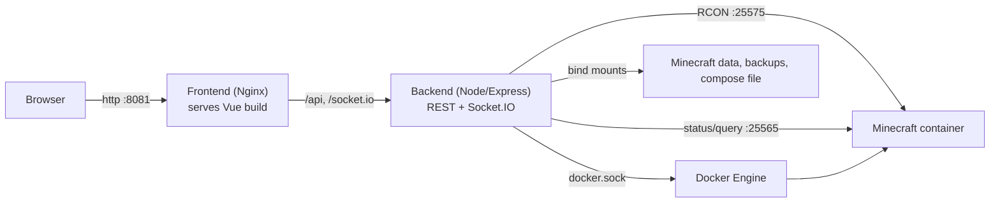

# MC Server - Control Panel

A web-based control panel for managing a Minecraft server running in Docker.

Monitor live server status, send console commands, manage players, edit `server.properties`, and create world backups from a single dashboard.


## Features

- **Live status control** — a single ONLINE/OFFLINE control in the header that starts and stops the Minecraft container with graceful shutdown (`save-all` via RCON)
- **Server data** — CPU and RAM usage, real Minecraft version, world name, and online time
- **Live console** — streaming Docker logs over Socket.IO with filtering, command history, and auto-reconnect when the server restarts
- **Player management** — online player list with kick, ban, and op actions, plus a whitelist manager and ban list (unban, ban by name, temporary bans with automatic unban) via RCON
- **MOTD editor** — colorized `§`-code editor with live preview and cursor-aware code insertion
- **Server icon editor** — 64×64 pixel editor with palette, fill, procedural generators, and image upload; writes `server-icon.png`
- **Settings** — edit `server.properties` with validation, automatic Docker Compose synchronization, and restart with status polling
- **Backups** — safe world backups (save-off/save-on coordination), list, download, delete, restore, scheduled backups, and automatic retention
- **Security** — optional bearer-token authentication for the API and WebSocket connections
- **Docker-native** — packaged as two small images with an Nginx frontend that proxies `/api` and `/socket.io` to the backend

## Architecture



- **Frontend** — Vue 3 + Vite, served by Nginx. Same-origin API calls: no backend URL is embedded in the production build.
- **Backend** — Express + Socket.IO. Uses Dockerode for container operations, `minecraft-server-util` for status/query and RCON, and the Docker socket to inspect, start, stop, and stream logs from the Minecraft container.

## Repository structure

```
mc-panel/
├── backend/               # Express + Socket.IO API server
│   ├── src/
│   │   ├── index.js       # Routes, auth middleware, WebSocket log streaming
│   │   ├── config.js      # Environment-based configuration
│   │   └── dockerService.js # Docker, RCON, properties, and backup operations
│   ├── Dockerfile
│   └── .env.example
├── frontend/              # Vue 3 + Vite application
│   ├── src/
│   │   ├── App.vue        # Dashboard layout and polling logic
│   │   ├── lib/api.js     # Centralized API/Socket.IO client
│   │   └── components/    # PlayerList, FastCommands, SettingsPanel, ...
│   ├── nginx.conf         # SPA fallback + API/WebSocket reverse proxy
│   ├── Dockerfile
│   └── .env.example
├── docker-compose.yml     # Panel stack (backend + frontend)
├── .env.example           # Compose environment template
└── DOCKER.md              # Detailed Docker deployment guide
```

## Quick start (Docker)

Requires an existing Minecraft deployment with its container named `minecraft-server`, data in `minecraft_data/`, and RCON enabled.

```bash
# 1. Create the shared network if needed
docker network create stark_net

# 2. Configure the panel
cp .env.example .env
#    Edit MINECRAFT_ROOT, RCON_PASSWORD, API_TOKEN, DOCKER_SOCKET_GID

# 3. Build and start
docker compose up -d --build

# 4. Verify
curl http://localhost:8081/api/health
```

Open `http://localhost:8081` and log in — the dashboard is ready.

See [DOCKER.md](DOCKER.md) for the complete step-by-step deployment, security notes, and troubleshooting.

### Required configuration

| Variable | Description |
|---|---|
| `MINECRAFT_ROOT` | Host directory containing `minecraft_data/`, `backups/`, and `docker-compose.yml` |
| `RCON_PASSWORD` | Must match the Minecraft container's RCON password |
| `API_TOKEN` | Strong token shared between backend and the frontend build |
| `DOCKER_SOCKET_GID` | Group ID of `/var/run/docker.sock` (`stat -c '%g' /var/run/docker.sock`) |
| `PANEL_PORT` | Published panel port (default `8081`) |

### Networking

The panel runs as a separate Compose project and attaches to your Minecraft stack's external network (`stark_net` by default). The backend reaches Minecraft through:

- `minecraft-server:25575` — RCON commands and graceful save
- `minecraft-server:25565` — server status and query probes (`MC_HOST`)
- `/var/run/docker.sock` — container inspection, start/stop, stats, and log streaming

The backend is **not** published to the host; only the Nginx frontend port is exposed.

## Local development

### Prerequisites

- Node.js ≥ 18
- Docker Engine with access to `/var/run/docker.sock`
- A running `minecraft-server` container with RCON enabled

### Install and run

```bash
npm install
npm --prefix backend install
npm --prefix frontend install

npm run dev
```

This starts the backend on `http://localhost:3005` and Vite on `http://localhost:5173` (bound to `0.0.0.0`). Vite proxies `/api` and `/socket.io` to the backend.

### Scripts

| Command | Description |
|---|---|
| `npm run dev` | Start backend and frontend together |
| `npm run dev:backend` | Start only the backend (nodemon) |
| `npm run dev:frontend` | Start only the Vite server |
| `npm run build` | Build the production frontend |
| `npm start` | Run the backend production server |

### Development environment

Backend variables can be set in `backend/.env` (see [backend/.env.example](backend/.env.example)). In local development the defaults work with a Minecraft stack published on the host:

- `MC_HOST=127.0.0.1` — status/query probes target localhost
- `RCON_HOST=127.0.0.1` — RCON on localhost
- `HOST_DATA_DIR`, `HOST_COMPOSE_FILE`, `BACKUP_DIR` — point to the host Minecraft paths

Frontend variables are build-time (`frontend/.env.local`):

| Variable | Purpose |
|---|---|
| `VITE_API_URL` | Backend URL; leave unset for same-origin/proxy usage |
| `VITE_API_TOKEN` | Token sent as `Authorization: Bearer` when the backend requires auth |

## API reference

Base URL: `http://localhost:3005` (dev) or through the Nginx proxy in Docker.

If `API_TOKEN` is configured, all endpoints except `/api/health` require:

```http
Authorization: Bearer <API_TOKEN>
```

Socket.IO connections pass the token in the auth payload:

```js
io(url, { auth: { token: API_TOKEN } })
```

| Endpoint | Method | Description |
|---|---|---|
| `/api/health` | GET | Health check, Docker reachability (no auth) |
| `/api/server/status` | GET | Running state, start time, world name, player count |
| `/api/server/query` | GET | Full query: MOTD, version, software, plugins, map, players (UDP with TCP fallback) |
| `/api/server/stats` | GET | CPU (`0–100%` of host capacity) and RAM (against the container's `MEMORY` limit) |
| `/api/server/start` | POST | Start the Minecraft container |
| `/api/server/stop` | POST | Graceful stop (`save-all` via RCON, then stop) |
| `/api/server/command` | POST | Send a console command via RCON |
| `/api/server/properties` | GET | Read `server.properties` (RCON password redacted) |
| `/api/server/properties` | POST | Update validated properties and sync the Compose file |
| `/api/server/backups` | GET | List backups |
| `/api/server/backups` | POST | Create a backup |
| `/api/server/backups/:name` | DELETE | Delete a backup |
| `/api/server/backups/:name/download` | GET | Download a backup archive (Bearer auth, no token in URL) |
| `/api/server/backups/:name/restore` | POST | Start a world restore (background job) |
| `/api/server/restore/status` | GET | Restore job progress (`phase`, `running`, `result`) |
| `/api/server/backups/schedule` | GET | Read the backup schedule |
| `/api/server/backups/schedule` | POST | Update the backup schedule |
| `/api/server/players/action` | POST | `kick`, `ban`, `unban`, `op`, `deop` via RCON |
| `/api/server/players/whitelist` | GET | List whitelisted players |
| `/api/server/players/whitelist` | POST | `add`, `remove`, `on`, `off`, `reload` |
| `/api/server/players/bans` | GET | List banned players (from `banned-players.json`) |
| `/api/server/players/tempban` | POST | Temporary ban; auto-pardon after `hours` |
| `/api/server/icon` | GET | Get the current server icon (data URL) |
| `/api/server/icon` | POST | Save a 64×64 PNG server icon |

### Example

```bash
curl -X POST http://localhost:3005/api/server/command \
  -H "Content-Type: application/json" \
  -H "Authorization: Bearer $API_TOKEN" \
  -d '{"command": "say Hello!"}'
```

### WebSocket events

The backend emits `log-line` events on the Socket.IO connection with live Minecraft console output. It automatically re-attaches to the container log stream after restarts.

## Backups

Backups are created safely against a live world:

1. RCON `save-off` disables automatic saves
2. `save-all` flushes pending writes
3. The world directory is archived with `tar`
4. `save-on` restores automatic saving

Backups are serialized (only one runs at a time). If `save-off` fails, the backup is aborted unless `ALLOW_UNSAFE_BACKUP=1`. Backups live in `BACKUP_DIR` (in Docker: `$MINECRAFT_ROOT/backups`) and are never copied into images.

### Restore

Restoring runs as a background job so large worlds don't time out HTTP requests:

1. The server is stopped gracefully (`save-all` via RCON, then container stop)
2. A safety snapshot of the current world is created (`pre-restore-*.tar.gz`)
3. The current world folder is moved aside and the backup is extracted in its place
4. The server is started again; on failure the old world is rolled back

The panel polls `/api/server/restore/status` and shows progress (stopping → snapshot → extracting → starting). Safety snapshots are kept and are exempt from retention cleanup.

### Scheduled backups & retention

The panel can run backups automatically every N hours (off by default) and prune old ones, keeping the most recent N. The schedule is stored as a JSON file inside the backups directory, so it survives container recreation and is editable from the Settings page. Initial defaults come from `BACKUP_SCHEDULE_ENABLED`, `BACKUP_INTERVAL_HOURS`, and `BACKUP_RETENTION`.

## Configuration reference

### Backend (`backend/.env`)

| Variable | Default | Description |
|---|---|---|
| `PORT` | `3005` | Backend HTTP/WebSocket port |
| `MC_HOST` | `127.0.0.1` | Minecraft host for status/query probes (`minecraft-server` in Docker) |
| `MC_STATUS_PORT` | `25565` | Minecraft status port |
| `MC_QUERY_PORT` | `25565` | Minecraft query port |
| `DOCKER_SOCKET` | `/var/run/docker.sock` | Docker socket path |
| `TARGET_CONTAINER_NAME` | `minecraft-server` | Managed container |
| `RCON_HOST` | `127.0.0.1` | RCON host |
| `RCON_PORT` | `25575` | RCON port |
| `RCON_PASSWORD` | — | RCON password (must match Minecraft) |
| `HOST_DATA_DIR` | — | Minecraft data directory |
| `HOST_COMPOSE_FILE` | — | Minecraft Compose file to keep in sync |
| `BACKUP_DIR` | — | Backup storage directory |
| `API_TOKEN` | unset | Enables Bearer auth when set |
| `CORS_ORIGIN` | `*` | CORS origin; restrict in production |
| `ALLOW_UNSAFE_BACKUP` | `0` | Allow backups when `save-off` fails |
| `ENABLE_BACKUP_DOWNLOAD` | `1` | Enable the backup download endpoint |
| `BACKUP_SCHEDULE_ENABLED` | `0` | Initial state of scheduled backups (panel UI can override) |
| `BACKUP_INTERVAL_HOURS` | `24` | Scheduled backup interval in hours |
| `BACKUP_RETENTION` | `10` | Keep the most recent N backups (`0` = unlimited) |

### Compose (`.env`)

See [.env.example](.env.example) for the complete list. Key values:

| Variable | Default | Description |
|---|---|---|
| `MINECRAFT_ROOT` | `/home/kukkimonsuta/docker/minecraft` | Host Minecraft directory |
| `PANEL_PORT` | `8081` | Published panel port |
| `MC_HOST` | `minecraft-server` | In-container Minecraft host |
| `MINECRAFT_NETWORK` | `stark_net` | External network joining the Minecraft stack |
| `DOCKER_SOCKET_GID` | `999` | Host Docker socket group |
| `API_TOKEN` | required | Panel authentication token |

## Security

- The backend mounts `/var/run/docker.sock`, which grants control over the Docker host. The backend port is never published; only the frontend is exposed.
- Use a strong `API_TOKEN`. The production frontend embeds it at build time, so rebuild the frontend image after changing it.
- Keep `.env` out of version control and restrict `CORS_ORIGIN` when the frontend and API are not same-origin.
- For exposure beyond localhost, place the panel behind TLS (e.g., a reverse proxy).

## Troubleshooting

**Panel shows `401` / data does not load**
- The backend has `API_TOKEN` set but the frontend was built without the matching `VITE_API_TOKEN`. Rebuild with `docker compose up -d --build`.

**Version, players, or MOTD are missing in Docker**
- Verify `MC_HOST=minecraft-server` and that both Compose projects share the same external network.

**World name shows `—`**
- The panel reads `level-name` from `server.properties`. If absent, it falls back to the world directory name. Verify the `MINECRAFT_ROOT` mount.

**Backend is unhealthy**
- Check `DOCKER_SOCKET_GID` against `stat -c '%g' /var/run/docker.sock` and that `minecraft-server` exists.

**RCON commands fail**
- Confirm `RCON_PASSWORD` matches the Minecraft container and `RCON_HOST=minecraft-server` in Docker.

**Port `8081` is already in use**
- Change `PANEL_PORT` in `.env` and run `docker compose up -d --force-recreate`.

**Dev proxy errors (`ECONNREFUSED 127.0.0.1:3005`)**
- The backend is not running. Use `npm run dev` from the repository root to start both services.

## Known limitations

- Restoring replaces the live world after stopping the server; a safety snapshot of the previous world is kept in the backups folder.
- Player management actions require RCON to be reachable. The ban list is read from the server's `banned-players.json`; temporary bans are panel-managed (stored in the backups folder) and expire automatically via a minute timer.
- The `API_TOKEN` is embedded in the production frontend bundle (build-time argument). Rotating the token requires rebuilding the frontend image.
- Editing properties while the server is running may be overwritten when Minecraft rewrites `server.properties` on shutdown.

## License

MIT
